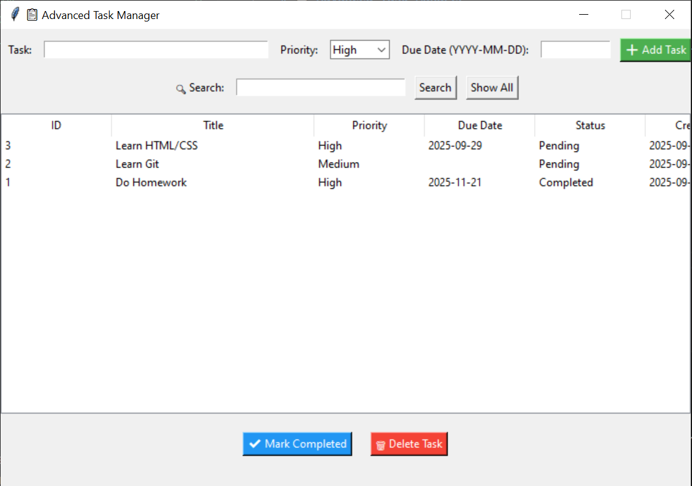

# 📋 Advanced Task Manager

A simple yet powerful Task Manager desktop application built using **Python**, **Tkinter**, and **SQLite**. This app allows users to manage daily tasks with ease — including features like priority levels, due dates, task search, and completion tracking.

---

## ✨ Features

- ✅ Add new tasks with:
  - Title
  - Priority (High, Medium, Low)
  - Due date
- 🔍 Search tasks by keyword
- ✔ Mark tasks as completed
- 🗑 Delete tasks
- 🕒 Auto-stores creation time
- 📊 Sorts tasks by most recently added
- 🎯 Persistent storage with SQLite

---

## 🖼️ Screenshot

> 

---

## 🛠️ Installation & Setup

### 🔸 Requirements

- Python 3.6 or higher
- `tkinter` (comes pre-installed with Python on most systems)
- No external dependencies required

---

### 🔸 Clone the Repository

```bash
git clone https://github.com/viveksaraswat123/Task-Manager-Application.git
cd Task-Manager-Application
